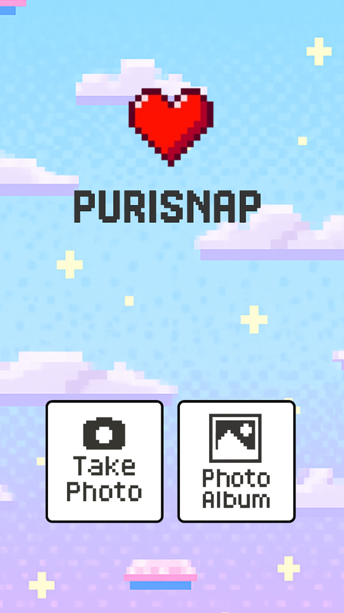

# 📸 PuriSnap (Purikura Sticker Photo App)

**PuriSnap**은 2000년대 감성의 **스티커 사진**을 디지털로 꾸밀수 있도록 구현한 React Native 기반의 앱입니다. 사용자는 사진에 **배경**, **스티커**, **필터** 등을 자유롭게 추가해서 꾸민후 저장할 수 있습니다.

---
## 🖼️ 스크린샷 예시

<table>
  <tr>
    <td align="center">
      <br/>
      <b>홈 화면</b>
    </td>
    <td align="center">
      <br/>
      <b>편집 화면</b>
    </td>
  </tr>
</table>

## 📁 프로젝트 구조

```
├── android                         # Android 네이티브 코드 디렉터리 (빌드용)
├── app                             # 주요 라우트 및 페이지 컴포넌트
│   ├── +not-found.tsx              # 잘못된 경로 접근 시 보여줄 404 페이지
│   ├── _layout.tsx                 # Stack 네비게이션 구조 설정
│   ├── bridge.tsx                  # 사진 크롭/중간 처리용 임시 페이지
│   ├── index.tsx                   # 앱 진입점(홈화면)
│   └── main.tsx                    # 메인 편집 화면
├── app.json                        # Expo 앱 메타데이터 및 설정
├── assets                          # 폰트, 이미지 등 앱 리소스 모음
│   ├── fonts
│   │   └── SpaceMono-Regular.ttf   # 기본 폰트 파일
│   └── images                      # 이미지 에셋
│       ├── common                  # 공통 UI 요소 (아이콘, 배경 등)
│       └── ...                     # 홈/메인 탭 별 이미지 정리
├── components                      # UI 컴포넌트 모음
│   └── ui
│       ├── bridge
│       │   └── customCropScreen.tsx  # 사진 자르기 UI 및 로직
│       ├── common
│       │   ├── editorCanvas        # 편집 캔버스 레이어별 컴포넌트
│       │   │   ├── backgroundImage.tsx  # 배경 이미지 처리
│       │   │   ├── drawingLayer.tsx     # 손글씨 레이어
│       │   │   ├── drawingToolbar.tsx   # 펜 툴바
│       │   │   ├── filterLayer.tsx      # 필터 오버레이
│       │   │   ├── stickerLayer.tsx     # 스티커 오버레이
│       │   │   ├── StickerItem.tsx      # 개별 스티커 이동/크기 조절
│       │   │   └── index.tsx            # 편집 영역 전체 관리
│       │   └── modal.tsx                # 공통 모달창 UI
│       ├── home
│       │   ├── home.tsx                 # 홈화면 UI
│       │   ├── buttonContainer.tsx      # 버튼 컨테이너
│       │   ├── homeButton.tsx           # 개별 버튼 스타일
│       │   └── logo.tsx                 # 앱 로고 컴포넌트
│       └── main
│           ├── main.tsx                 # 메인 편집화면 컨테이너
│           ├── tabBar.tsx              # 하단 탭바 UI
│           └── utils/images.ts         # 이미지 필터링 및 정리 유틸
├── eas.json                        # EAS 빌드 설정 파일
├── eslint.config.js               # ESLint 설정
├── expo-env.d.ts                  # Expo 타입 확장 정의
├── scripts                        # 프로젝트 유틸 스크립트 (예: 초기화)
├── store                          # 상태 관리(zustand)
│   ├── useEditorStore.ts          # 편집 관련 상태 저장소 (배경, 스티커, 필터 등)
│   └── useImageStore.ts           # 선택된 이미지 상태 저장소
└── tsconfig.json                 # TypeScript 설정
```

---

## 주요 기능     

| 기능         | 설명                           |
| ---------- | ---------------------------- |
| 📷 사진 불러오기 | 갤러리또는 직접 바로 사진을찍은후 사진을 선택한후 편집 시작         |
| 🖼 배경 설정   | 사진 아래에 배경 이미지 설정             |
| 🌈 필터 적용   | 이미지에 필터 레이어를 씌우는 기능 적용             |
| 🐱 스티커 추가  | 여러 개의 스티커를 사진 위에 자유롭게 배치     |
| 💾 저장 기능   | 꾸미는 사진을 캡처해서 갤러리리에 저장         |
| ✂️ 사진 크롭   | 사용자가 자원을 집중적으로 선택하고 편집전 미리 사진 확대,축소,회전,크롭등의 기능 제공 |

---

## 실행 방법

### 1. 의존성 설치

```bash
npm install
```

### 2. Expo 개발 서버 실행

```bash
npm run start
```

### 3. Android실행

```bash
npm run android    # 안드로이드 시뮬레이터 또는 디바이스
```

---

##  👀 코드를 처음 보는 사람을 위한 가이드

1. **`app/index.tsx`**: 앱 진입점. `<HomeContainer />`를 통해 초기 화면 렌더링.
2. **`_layout.tsx`**: Expo Router 기반의 Stack 네비게게이션 정의.
3. **`main.tsx`**: 실제 사진 꾸꾸미기 UI 구현 예정 위치.
4. **Zustand Store**:

   * `useEditorStore`: 배경, 스티커, 필터 상태 관리
   * `useImageStore`: 불러온 이미지 상태 관리

---

## Zustand 상태 구조 예시

```ts
// useEditorStore.ts
{
  imageUri: string | null,
  backgroundUri: string | null,
  stickers: [
    { id, source, x, y, scale }
  ],
  filter: string | null
}
```

---

## 주요 의존 패키지

| 패키지                      | 설명                |
| ------------------------ | ----------------- |
| `expo-router`            | 라우팅팅 시스템          |
| `zustand`                |  전역 상태 관리 |
| `react-native-view-shot` | 화면 저장/캡처        |
| `expo-image-picker`      | 사진 선택             |
| `expo-media-library`     | 저장 기능             |
| `styled-components`      | 스타일링 라이브러리        |
| `react-native-reanimated`      | 고성능 애니메이션 및 제스처 처리 최적화       |

---

