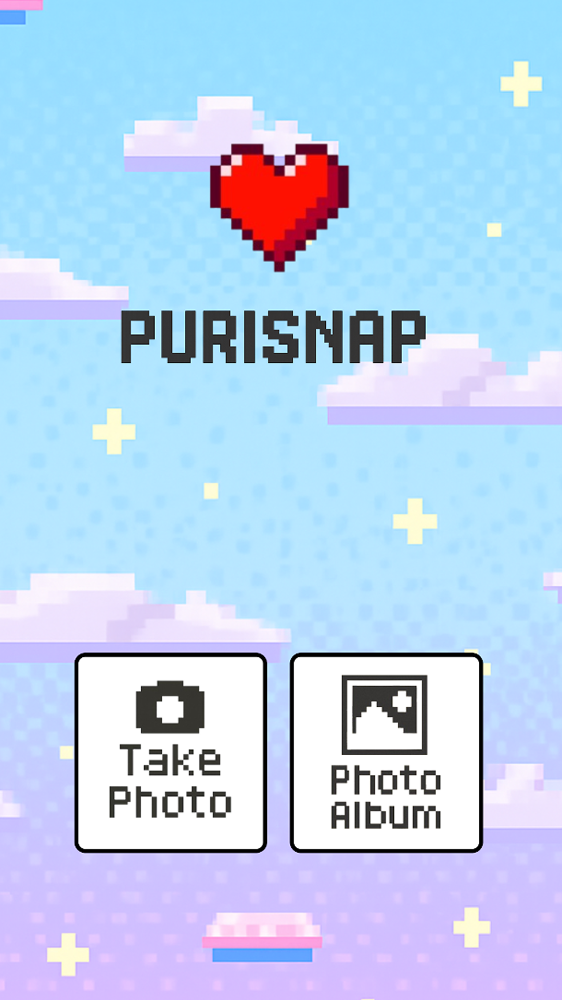

# 📸 PuriSnap (Purikura Sticker Photo App)

**PuriSnap**은 2000년대 감성의 **스티커 사진**을 디지털로 꾸밀 수 있도록 만든 React Native(Expo) 앱입니다. 사진에 **배경**, **스티커**, **필터**, **펜(그리기)** 등을 적용한 뒤 **갤러리에 저장**할 수 있습니다.

- **Expo SDK**: 53 · **React Native**: 0.79 · **앱 버전**: 1.2.1 (`app.json`)
- **개발 빌드**: `expo-dev-client` 사용 → 로컬에서는 `npm run android` / `npm run ios`가 네이티브 프로젝트를 생성·빌드합니다(`android/`, `ios/`는 Git에 커밋되지 않은 상태일 수 있음).

**Google Play**: [purisnap - 스티커 사진 꾸미기 & 사진 편집](https://play.google.com/store/apps/details?id=com.leesuyoen.purisnapapp&hl=gsw)

---

## 🖼️ 스크린샷 예시

<table>
  <tr>
    <td align="center">
      <br/>
      <b>홈 화면</b>
    </td>
    <td align="center">
      <br/>
      <b>편집 화면</b>
    </td>
  </tr>
</table>

---

## 📁 프로젝트 구조

```
├── __mocks__/                      # Jest 등에서 사용하는 모킹 파일
├── __tests__/                      # 단위 테스트 (Jest)
├── app/                            # Expo Router 라우트
│   ├── +not-found.tsx              # 404
│   ├── _layout.tsx                 # 루트 레이아웃·네비게이션
│   ├── bridge.tsx                  # 크롭 등 중간 처리 화면
│   ├── index.tsx                   # 진입 홈 (`HomeContainer`)
│   └── main.tsx                    # 편집 화면 진입 (`EditorScreen`)
├── app.json                        # Expo 설정·플러그인(광고 SDK 등)
├── assets/images/                  # 아이콘·배경·스티커·필터 등 이미지 에셋
├── components/ui/
│   ├── bridge/customCropScreen.tsx # 크롭 UI
│   ├── common/
│   │   ├── editorCanvas/           # 편집 캔버스 레이어
│   │   │   ├── BackgroundImage.tsx
│   │   │   ├── DrawingLayer.tsx
│   │   │   ├── drawingToolbar.tsx
│   │   │   ├── filterLayer.tsx
│   │   │   ├── StickerLayer.tsx
│   │   │   ├── StickerItem.tsx
│   │   │   └── index.tsx
│   │   └── modal.tsx
│   ├── home/                       # 홈 화면 컴포넌트
│   └── main/
│       ├── main.tsx                # 편집 화면 컨테이너·배너·시트
│       ├── tabBar.tsx              # 하단 탭바
│       └── utils/images.ts         # 배경·스티커·필터 데이터
├── e2e/                            # Playwright E2E 스펙
├── i18n/                           # 다국어 문자열·설정
├── eas.json                        # EAS Build 설정
├── eslint.config.js
├── playwright.config.ts            # E2E 설정
├── store/
│   ├── useEditorStore.ts           # 배경·스티커·필터·리셋 등 편집 상태
│   └── useImageStore.ts            # 선택 이미지 URI·메인 로고 표시 여부
├── scripts/
├── package.json
└── tsconfig.json
```

로컬에서 Android/iOS 네이티브 폴더가 필요하면 `npx expo prebuild` 또는 `npm run android` / `npm run ios`로 생성합니다.

---

## 주요 기능

| 기능 | 설명 |
| --- | --- |
| 📷 사진 불러오기 | 갤러리 선택 또는 촬영 후 편집 화면으로 이동 |
| 🖼 배경 | 편집 캔버스 배경 이미지 변경 |
| 🌈 필터 | 필터 레이어 적용 |
| 🐱 스티커 | 여러 스티커 배치·이동·크기·회전 |
| ✏️ 펜 | 그리기 레이어 및 툴바 |
| 💾 저장 | 뷰 캡처 후 갤러리(`expo-media-library`)에 저장 |
| ✂️ 크롭 | 확대/축소/회전·크롭 등 (`customCropScreen`) |
| 📢 배너 광고 | `react-native-google-mobile-ads` (`app.json` 플러그인) |

---

## 실행 방법

### 1. 의존성 설치

```bash
npm install
```

### 2. 개발 서버

```bash
npm run start
```

에뮬레이터에서 Metro 연결이 안 되면 `npx expo start --localhost`와 `adb reverse tcp:8081 tcp:8081`을 참고하세요.

### 3. Android

```bash
npm run android
```

(`expo run:android` — 필요 시 `android/` 생성 후 빌드)

### 4. iOS (macOS)

```bash
npm run ios
```

### 5. 웹 (선택)

```bash
npm run web
```

---

## 테스트

단위 테스트(Jest):

```bash
npm run test
```

E2E(Playwright):

```bash
npm run test:e2e
```

---

## 코드 가이드 (처음 보는 분용)

1. **`app/index.tsx`**: 홈 진입, `HomeContainer` 렌더링.
2. **`app/main.tsx`**: `components/ui/main/main.tsx`의 `EditorScreen`을 노출.
3. **`app/_layout.tsx`**: Expo Router 스택·공통 레이아웃.
4. **`components/ui/main/main.tsx`**: 편집 UI·하단 탭·바텀시트·배너 등 화면 조립.
5. **상태**
   - **`useImageStore`**: 편집에 사용하는 이미지 URI, 메인 배경 로고 표시 여부.
   - **`useEditorStore`**: 배경 URI, 스티커 배열, 필터, 리셋 버전 등.

---

## Zustand 상태 요약

```ts
// useImageStore
{
  imageUri: string | null;
  showMainBgLogo: boolean;
}

// useEditorStore (발췌)
{
  backgroundUri: string | null;
  stickers: { id, source, x, y, scale, rotation }[];
  filter: FilterItem | null;
  resetVersion: number;
}
```

---

## 주요 의존 패키지

| 패키지 | 설명 |
| --- | --- |
| `expo` / `expo-router` | Expo 런타임·파일 기반 라우팅 |
| `expo-dev-client` | 커스텀 개발 빌드 |
| `expo-updates` | EAS Update 연동 |
| `expo-localization` / `i18n/` | 로케일·문자열 |
| `zustand` | 전역 상태 |
| `react-native-view-shot` | 저장용 캡처 |
| `expo-image-picker` | 사진 선택 |
| `expo-media-library` | 갤러리 저장 |
| `styled-components` | 스타일링 |
| `react-native-reanimated` | 애니메이션·제스처 |
| `react-native-google-mobile-ads` | AdMob 배너 등 |

---

## 린트

```bash
npm run lint
```
